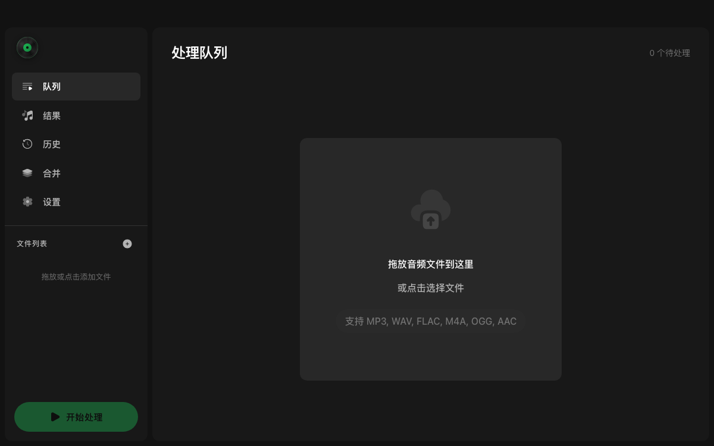

# BGM Player

> A desktop app that pulls the **background music** out of any song — removing vocals (or splitting into stems) with the [Demucs](https://github.com/adefossez/demucs) AI models, all on your own machine.

<p align="center">
  <a href="LICENSE"></a>
  
  
  
  
</p>

<p align="center">English · <a href="README.zh-CN.md">简体中文</a></p>

<p align="center"></p>

## Download

Grab the latest **signed & notarized** macOS build (Apple Silicon) from [**Releases**](https://github.com/JackCaow/bgm-player/releases/latest): download the `.dmg`, drag **BGM Player** to Applications, double-click. htdemucs vocal/BGM separation runs fully offline — no Python or extra setup required.

## Features

- 🎵 **Vocal / BGM separation** — strip vocals to keep the instrumental, or split a track into 2 / 4 / 6 stems.
- 🧠 **Multiple Demucs models** — `htdemucs` (balanced), `htdemucs_ft` (highest quality), `htdemucs_6s` (6 stems), `mdx_extra`.
- ⚡ **GPU accelerated** — Apple Silicon **MPS** and NVIDIA **CUDA** are used automatically, with CPU fallback.
- 📋 **Batch queue** — drag-and-drop multiple files (MP3, WAV, FLAC, M4A, OGG, AAC) and process them in sequence.
- 🎚️ **Track merging** — recombine stems with per-track volume control and export.
- 🔊 **Built-in player** — preview BGM / vocals / mix with independent volume and waveform.
- 🗂️ **History & projects** — keep a record of every extraction, reopen output folders, organize work into projects.
- 🎛️ **Flexible export** — WAV / FLAC (lossless) or MP3 / AAC / M4A / OGG / OPUS, with sample-rate and bitrate control.
- 🌓 **Polished UI** — light / dark / system themes, English & 简体中文.

## Tech Stack

| Layer | Stack |
|------|-------|
| Frontend | Vue 3 · TypeScript · Tailwind CSS · reka-ui |
| Desktop shell | Tauri 2 (Rust) |
| Audio separation | Rust · [ONNX Runtime](https://onnxruntime.ai/) (htdemucs) + Python · [Demucs](https://github.com/adefossez/demucs) fallback |
| Audio I/O & merging | FFmpeg |

The Rust backend exposes `extract_bgm` and `merge_tracks`. **htdemucs 2-track (vocals + BGM) separation runs in-process via Rust + ONNX Runtime — no Python at runtime**, which is what makes the shipped app self-contained and offline. Other models/modes (`htdemucs_ft`, `htdemucs_6s`, `mdx_extra`, and 4/6-track) fall back to a Python/Demucs script. Merging uses FFmpeg.

## Prerequisites

- **Node.js** ≥ 18 and npm
- **Rust** (stable) — `rustup default stable`
- **FFmpeg** on your `PATH` (required for merging and audio decoding)
- **Python 3.10–3.12** with Demucs (for the dev extraction path — see below). *Note: very new Python versions (e.g. 3.14) may not have PyTorch wheels yet.*

## Getting Started (Development)

```bash
# 1. Clone
git clone https://github.com/JackCaow/bgm-player.git
cd bgm-player

# 2. Frontend deps
npm install

# 3. Python env for Demucs (used by the dev extraction path)
#    uv is recommended; plain python -m venv works too.
uv venv --python 3.11 .venv
uv pip install --python .venv/bin/python demucs scipy numpy

# 4. Launch the desktop app (puts the venv's python on PATH so extraction works)
bash script/dev.sh
```

`script/dev.sh` is a thin wrapper that prepends `.venv/bin` to `PATH` (so the app's `python3` resolves to the Demucs-enabled interpreter), sets `PYTORCH_ENABLE_MPS_FALLBACK=1`, and runs `npm run tauri:dev`.

If you have a system-wide Python with Demucs already installed, you can run `npm run tauri:dev` directly.

> On first extraction, Demucs downloads the selected model (tens to hundreds of MB) and caches it.

## Building

> Most users should just **[download a release](https://github.com/JackCaow/bgm-player/releases/latest)** — it's signed, notarized, and self-contained. Build locally only if you're hacking on the app.

### Standalone build (offline ONNX)

The recommended way to ship is the bundled ONNX path: a native Rust separator runs the htdemucs model with [ONNX Runtime](https://onnxruntime.ai/), so **htdemucs 2-track (vocals + BGM) extraction works fully offline with no Python/PyTorch on the user's machine.**

1. **Generate the ONNX model first.** The weights (`src-tauri/resources/models/htdemucs.onnx`, ~300 MB) are gitignored, so they must exist on disk before bundling — otherwise the bundler will fail (the resource is required):

   ```bash
   .venv/bin/python script/export_onnx.py
   ```

2. **Build the bundle:**

   ```bash
   npm run tauri:build      # native bundle (.app / .dmg on macOS)
   ```

   The model is declared in `src-tauri/tauri.conf.json` under `bundle.resources` as a map (`"resources/models/htdemucs.onnx": "models/htdemucs.onnx"`), which places it at `Contents/Resources/models/htdemucs.onnx` inside the `.app` — exactly where the Rust `resolve_model_path` looks for it in production.

Notes:

- The ONNX path covers **htdemucs 2-track** only. Other models (`htdemucs_ft`, `htdemucs_6s`, `mdx_extra`) and multi-stem modes still use the Python/Demucs environment.
- Set `BGM_DISABLE_ONNX=1` (any value) to force the legacy Python path even for htdemucs 2-track.
- ONNX Runtime currently uses the CPU execution provider. The `coreml` ort feature is a future toggle for CoreML/ANE acceleration on Apple Silicon.
- The bundled `.app` is large (~300 MB model + the statically linked ONNX Runtime), so the resulting `.app`/`.dmg` runs to several hundred MB.

### Automated releases (CI)

Pushing a `vX.Y.Z` tag runs [`.github/workflows/release.yml`](.github/workflows/release.yml) on a macOS (Apple Silicon) runner: it fetches the htdemucs ONNX model from the `models` release asset, builds, **code-signs + notarizes** (when the `APPLE_*` repository secrets are configured), and publishes the `.dmg`/`.app` to a GitHub Release. Without the Apple secrets it still builds, but unsigned (open via `xattr -cr "/Applications/BGM Player.app"`).

## Models

| Model | Stems | Notes |
|-------|-------|-------|
| `htdemucs` | 4 (vocals/drums/bass/other) | Recommended — balanced speed & quality |
| `htdemucs_ft` | 4 | Fine-tuned — highest quality, slower |
| `htdemucs_6s` | 6 (+ guitar/piano) | Six-stem separation |
| `mdx_extra` | 4 | Alternative MDX-based model |

## Project Structure

```
src/                 Vue 3 frontend (components, composables, i18n, utils)
src-tauri/           Rust backend — Tauri commands (src/lib.rs) + ONNX separator (src/separator/)
script/              Python extraction + ONNX export (export_onnx.py) + dev launcher (dev.sh)
assets/              Screenshots and static assets used by the README
```

## Contributing

Issues and pull requests are welcome. There's no enforced linter/formatter — please match the existing code style (2-space indentation, double quotes in TS/JS, PascalCase Vue components, `useX.ts` composables).

## Acknowledgements

- [Demucs](https://github.com/adefossez/demucs) — the music source separation models that power extraction.
- [Tauri](https://tauri.app/) — the lightweight desktop framework.
- [FFmpeg](https://ffmpeg.org/) — audio decoding and merging.

## License

[MIT](LICENSE) © 2026 JackCaow
